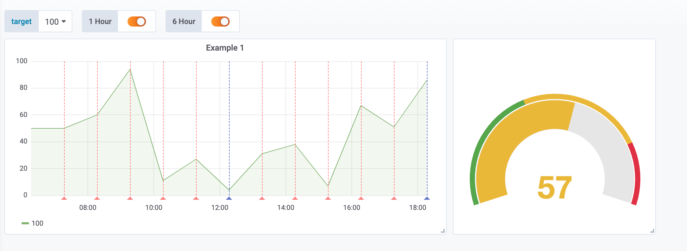

## Lumen data source (PHP) for Grafana

Today I need to integrate a third party service into Grafana. I cannot access directly to the service's database, so I will integrate via JSON datasource. Grafana allows us to build custom data sources but in this case I don't need to create a new one. I can use the simple JSON datasource

> grafana-cli plugins install grafana-simple-json-datasource

Now I need to create one REST server to serve the data that our JSON datasource needs. According to the documentation we need three routes:

GET / should return 200 ok.
POST /search used by the find metric options on the query tab in panels.
POST /query should return metrics based on input. 
POST /annotations should return annotations.

We're going to create a PHP/Lumen server. Basically the routes of the application are those ones:
```php
<?php

use Laravel\Lumen\Routing\Router;
use App\Http\Middleware;
use Laravel\Lumen\Application;
use Dotenv\Dotenv;
use App\Http\Handlers;

require_once __DIR__ . '/../vendor/autoload.php';

(Dotenv::create(__DIR__ . '/../env/local'))->load();

$app = new Application(dirname(__DIR__));
$app->middleware([
    Middleware\CorsMiddleware::class,
]);

$app->router->group(['middleware' => Middleware\AuthMiddleware::class], function (Router $router) {
    $router->get('/', Handlers\HelloHandler::class);
    $router->post('/search', Handlers\SearchHandler::class);
    $router->post('/query', Handlers\QueryHandler::class);
    $router->post('/annotations', Handlers\AnnotationHandler::class);
});

return $app;
```

We need to take care with CORS. I will use the Middleware that I normally use in those cases

```php
<?php

namespace App\Http\Middleware;

use Closure;

class CorsMiddleware
{
    public function handle($request, Closure $next)
    {
        $headers = [
            'Access-Control-Allow-Origin'      => 'http://localhost:3000',
            'Access-Control-Allow-Methods'     => 'POST, GET, OPTIONS, PUT, DELETE',
            'Access-Control-Allow-Credentials' => 'true',
            'Access-Control-Max-Age'           => '86400',
            'Access-Control-Allow-Headers'     => 'accept, content-type, Content-Type, Authorization, X-Requested-With',
        ];

        if ($request->isMethod('OPTIONS')) {
            return response()->json('{"method":"OPTIONS"}', 200, $headers);
        }

        $response = $next($request);
        foreach ($headers as $key => $value) {
            $response->header($key, $value);
        }

        return $response;
    }
}
```
I'll use also a basic authentication so we'll use a simple Http Basic Authentication middleware
```php
<?php

namespace App\Http\Middleware;

use Closure;
use Illuminate\Http\Request;

class AuthMiddleware
{
    const NAME = 'auth.web';

    public function handle(Request $request, Closure $next)
    {
        if ($request->getUser() != env('HTTP_USER') || $request->getPassword() != env('HTTP_PASS')) {
            $headers = ['WWW-Authenticate' => 'Basic'];

            return response('Unauthorized', 401, $headers);
        }

        return $next($request);
    }
}
```


HelloHandler is a dummy route that the datasource needs to check the connection. We only need to answer with a 200-OK
```php
<?php
namespace App\Http\Handlers;

class HelloHandler
{
    public function __invoke()
    {
        return "Ok";
    }
}

```

SearchHandler will return the list of available metrics that we´ll use within our grafana panels. They aren't strictly necessary. We can return an empty array and use later one metric that it isn't defined here (it's only to fill the combo that grafana shows us)

```php
<?php
namespace App\Http\Handlers;

class SearchHandler
{
    public function __invoke()
    {
        return [25, 50, 100];
    }
}
```

QueryHandler is an important one. Here we'll return the datapoints that we´ll show in grafana. For testing purposes I've created one handler that read the metric, and the date from and date to that grafana sends to the backend and return a random values for several metrics and fixed ones to the rest. It's basically to see something in grafana. Later, in the real life project, I'll query the database and return real data.
 
```php
<?php

namespace App\Http\Handlers;

use Illuminate\Http\Request;

class QueryHandler
{
    public function __invoke(Request $request)
    {
        $json   = $request->json();
        $range  = $json->get('range');
        $target = $json->get('targets')[0]['target'];

        $tz   = new \DateTimeZone('Europe/Madrid');
        $from = \DateTimeImmutable::createFromFormat("Y-m-d\TH:i:s.uP", $range['from'], $tz);
        $to   = \DateTimeImmutable::createFromFormat("Y-m-d\TH:i:s.uP", $range['to'], $tz);

        return ['target' => $target, 'datapoints' => $this->getDataPoints($from, $to, $target)];
    }

    private function getDataPoints($from, $to, $target)
    {
        $interval = new \DateInterval('PT1H');
        $period   = new \DatePeriod($from, $interval, $to->add($interval));

        $dataPoints = [];
        foreach ($period as $date) {
            $value        = $target > 50 ? rand(0, 100) : $target;
            $dataPoints[] = [$value, strtotime($date->format('Y-m-d H:i:sP')) * 1000];
        }

        return $dataPoints;
    }
}
```

Also I'll like to use annotations. It's something similar. AnnotationHandler will handle this request. For this test I've created two types of annotations: One each hour and another one each 6 hours

```php
<?php

namespace App\Http\Handlers;

use Illuminate\Http\Request;

class AnnotationHandler
{
    public function __invoke(Request $request)
    {
        $json       = $request->json();
        $annotation = $json->get('annotation');
        $range      = $json->get('range');
        error_log(json_encode($json->all()));

        return $this->getAnnotations($annotation, $range);
    }

    private function getAnnotations($annotation, $range)
    {
        return $this->getValues($range, 'PT' . $annotation['query'] . 'H');
    }


    private function getValues($range, $int)
    {
        $tz   = new \DateTimeZone('Europe/Madrid');
        $from = \DateTimeImmutable::createFromFormat("Y-m-d\TH:i:s.uP", $range['from'], $tz);
        $to   = \DateTimeImmutable::createFromFormat("Y-m-d\TH:i:s.uP", $range['to'], $tz);

        $annotation = [
            'name'       => $int,
            'enabled'    => true,
            'datasource' => "gonzalo datasource",
            'showLine'   => true,
        ];

        $interval = new \DateInterval($int);
        $period   = new \DatePeriod($from, $interval, $to->add($interval));

        $annotations = [];
        foreach ($period as $date) {
            $annotations[] = ['annotation' => $annotation, "title" => "H " . $date->format('H'), "time" => strtotime($date->format('Y-m-d H:i:sP')) * 1000, 'text' => "teeext"];
        }

        return $annotations;
    }
}
```

And that's all. I've also put the whole example in a docker-compose file to test it

```yaml
version: '2'

services:
  nginx:
    image: gonzalo123.nginx
    restart: always
    ports:
      - "80:80"
    build:
      context: ./src
      dockerfile: .docker/Dockerfile-nginx
    volumes:
      - ./src/api:/code/src
  api:
    image: gonzalo123.api
    restart: always
    build:
      context: ./src
      dockerfile: .docker/Dockerfile-lumen-dev
    environment:
      XDEBUG_CONFIG: remote_host=${MY_IP}
    volumes:
      - ./src/api:/code/src
  grafana:
    image: gonzalo123.grafana
    build:
      context: ./src
      dockerfile: .docker/Dockerfile-grafana
    restart: always
    environment:
      - GF_SECURITY_ADMIN_USER=${GF_SECURITY_ADMIN_USER}
      - GF_SECURITY_ADMIN_PASSWORD=${GF_SECURITY_ADMIN_PASSWORD}
      - GF_USERS_DEFAULT_THEME=${GF_USERS_DEFAULT_THEME}
      - GF_USERS_ALLOW_SIGN_UP=${GF_USERS_ALLOW_SIGN_UP}
      - GF_USERS_ALLOW_ORG_CREATE=${GF_USERS_ALLOW_ORG_CREATE}
      - GF_AUTH_ANONYMOUS_ENABLED=${GF_AUTH_ANONYMOUS_ENABLED}
    ports:
      - "3000:3000"
    volumes:
      - grafana-db:/var/lib/grafana
      - grafana-log:/var/log/grafana
      - grafana-conf:/etc/grafana
volumes:
  grafana-db:
    driver: local
  grafana-log:
    driver: local
  grafana-conf:
    driver: local
```

Here you can see the example in action:



Links:
* https://grafana.com/plugins/grafana-simple-json-datasource
* https://grafana.com/docs/plugins/developing/datasources/
* https://github.com/bergquist/fake-simple-json-datasource
